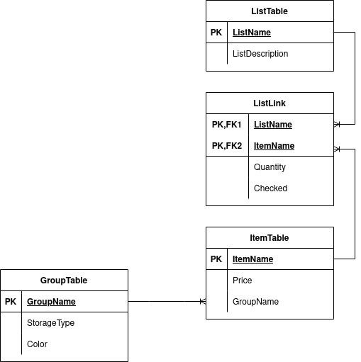

# Shopping List App

## Plan:

- Typescript
- API Properly structured

## Database:

Made in MYSQL

## Architecture

[REST API Design Best Practices Handbook - How to Build a REST API with JavaScript, Node.js, and Express.js](https://www.freecodecamp.org/news/rest-api-design-best-practices-build-a-rest-api/)

Using best practices described above
